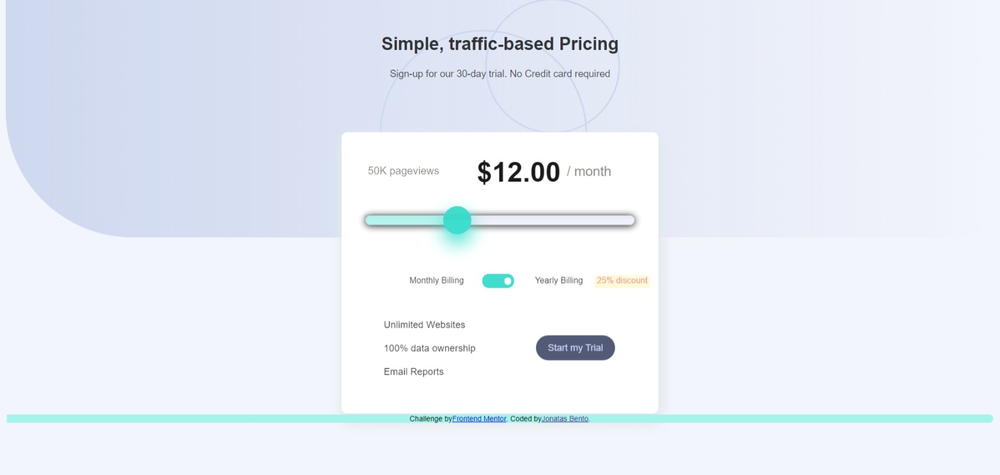
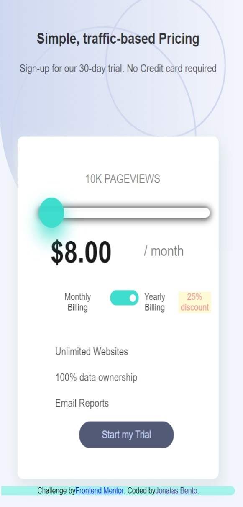

# Frontend Mentor - Interactive pricing component solution

This is a solution to the [Interactive pricing component challenge on Frontend Mentor](https://www.frontendmentor.io/challenges/interactive-pricing-component-t0m8PIyY8). 
 

## Table of contents

- [Overview](#overview)
  - [The challenge](#the-challenge)
  - [Screenshot](#screenshot)
  - [Links](#links)
- [My process](#my-process)
  - [Built with](#built-with)
  - [What I learned](#what-i-learned)
  - [Continued development](#continued-development)
  - [Useful resources](#useful-resources)
- [Author](#author)
- [Acknowledgments](#acknowledgments)

## Overview

- I got this challenge in order to improve my habilities in manipulating DOM elements. Although we find a beautiful and challenging layout, the most important thing to me was the interaction between an input and the results through HTML output.

### The challenge

Users should be able to:

- View the optimal layout for the app depending on their device's screen size
- See hover states for all interactive elements on the page
- Use the slider and toggle to see prices for different page view numbers

### Screenshot





### Links

- Solution URL: [Add solution URL here](https://your-solution-url.com)
- Live Site URL: [Add live site URL here](https://your-live-site-url.com)


## My process

### Built with

- Semantic HTML5 markup
- CSS custom properties
- Flexbox
- CSS Grid


### What I learned

As I told, what I loved in doing this project were the ability developed in relation to the DOM Manipulation. Look at this implementation below:


```js
const slider = document.querySelector('.slider-input');
let output1 = document.querySelector('.info1');
let output2 = document.querySelector('.info2');
slider.oninput = function(){
if (slider.value <= 8){
    output2.innerHTML = '$8.00';
    output1.innerHTML = '10K PAGEVIEWS'
```

### Continued development

With this I am trying to make myself comfortable with some techniques that are available through manipulation of DOM. And because of that I intend to move forward, probably using frameworks like REACTJS and VUE for next challenges.

### Useful resources

- [Example resource 1](https://www.example.com) - This helped me for XYZ reason. I really liked this pattern and will use it going forward.
- [Example resource 2](https://www.example.com) - This is an amazing article which helped me finally understand XYZ. I'd recommend it to anyone still learning this concept.


## Author

- Github - [Jonatas Bento](https://github.com/jonatas-bento)
- Frontend Mentor - [@jonatas-bento](https://www.frontendmentor.io/profile/jonatas-bento)


## Acknowledgments

Once more I would like to give thanks to my teachers (Leandro Leite and Patrick Reis). They have been helping me to improve my skills and if there is still something missing here it is my fault. But if there is something good, for sure it's because they helped me. Thank you both again! 